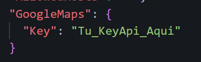
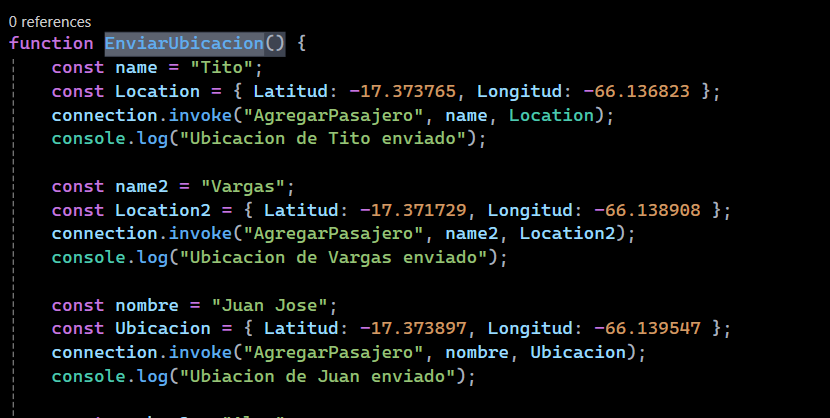

# Modificaciones Permitidas

Este proyecto está protegido bajo una **Licencia de Uso Restringido**. Sin embargo, se permiten modificaciones en las siguientes partes del código:

## Partes Modificables

**1 Archivo `appsettings.json`**:

Puedes modificar la cadena de conexión de MongoDB y el nombre de la base de datos para adaptarlo a tu entorno local o de producción.

**Cadena de conexión**: Cambia la el archivo **`appsettings.json`**, en la parte de **Key** ahi debes de poner un Key api de google clound para que el sistema pueda funcionar bien.

**Ubicaciones** 
En la parte de wwwroot > js > Mapa.js en la funcion EnviarUbicacion().

Podemos cambiar el nombre y la ubicaciones como la Latiutd y Longitud para una simulación personalizada de los marcadores.

**Nota**: Cualquier modificación no autorizada en partes no permitidas constituye una violación de los términos de la licencia.