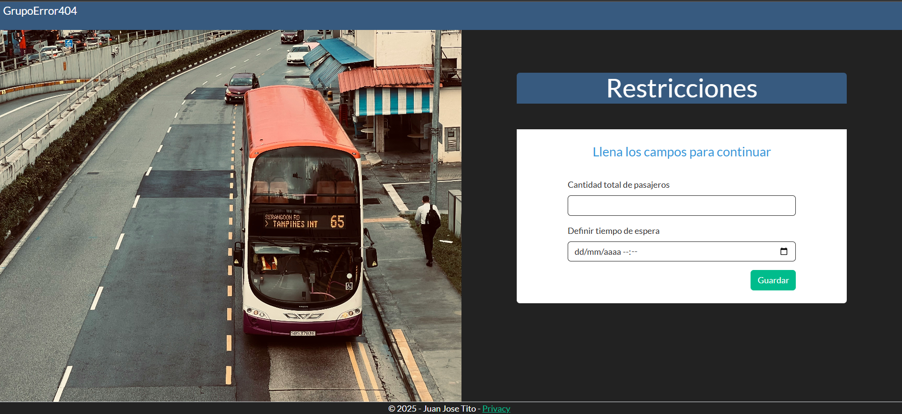

# Sistema de Ruta Optima 


## Descripción

Este sistema es un prototipo hecho para un proyecto universitario de la materia de **estructura de datos** desarrollado con **Asp .net core**, usando estructuras de datos como son **Tabla Hash y Colas**.


## 🛠️ Tecnologías utilizadas

- ASP.NET Core
- SignalR
- Google Maps JavaScript API
- HTML/CSS/JavaScript
- Bootstrap
- C#

## Instalación

Sigue estos pasos para configurar y ejecutar el proyecto localmente:

**Clona el repositorio**:

```bash
git clone https://github.com/JuanTito-Dev/Ruta-Optima.git

cd Ruta-Optima
```

**Modificaciones permitidas**:

Antes de correr o ejecutar la aplicacion web debes de hacer unas moficaciones al codigo solo las permitidas.

- Solo se permiten modificaciones en el codigo en las partes especificadas en el archivo [Modificaciones](MODIFICACIONES_PERMITIDAS.md).

## Capturas de Pantalla

A continuación, se muestran algunas capturas de pantalla de la aplicación en funcionamiento:



Al ingresar a la aplicación lo primero que nos pedira es restricciones que son la cantidad de pasajeros y hora y fecha de espera. 


Luego nos mostrará un mapa donde observaremos nuestra ubicacion, al hacer clik en el boton enviar el sistema recibira la ubicaciones cargadas.


Luego nos mostrará los marcadores y con nombres en el mapa. Para calcular la ruta optima debemos de hacer clik en calular ruta.


Despues podremos observar un ruta optima para recoger a todos, **dato** debemos de hacercarnos a menos de 100 metros para poder recoger a cada usuario.


Cuando nos hacerquemos a un usuario nos saldra un boton que que dira Recoger a y el nombre del usuario. Hacemos clik y el sistema borrará el marcador del mapa y seguimos con todos los pasajeros.


Una vez recogido a todos los pasajeros nos saldra un Boton de terminar viaje que mostrará un Historial de todos los pasajeros recogidos sus nombre y su ubicación.

**Nota** Este sistema es solo un prototipo ya que la funcionalidad de enviar ubicaciones no existe se tendria que implementar esa parte y subirlo a un servidor para que funcione mientras las ubicaciones se define en el codigo. en la parte de wwwroot > js > Mapa.js.


